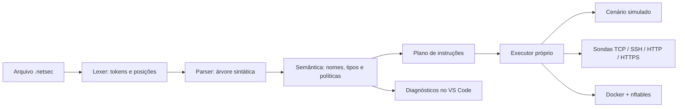

# Arquitetura e guia para a arguição

## Onde estudar

| Arquivo | Responsabilidade | Pergunta que a equipe deve conseguir responder |
|---|---|---|
| `core/lexer.py` | Reconhecer lexemas e manter posições | Como distinguir `=` de `==`? |
| `core/parser.py` | Descendente recursivo e precedência | Por que `1 + 2 * 3` gera 7? |
| `core/model.py` | Nós da árvore e diagnósticos | Como um erro conserva arquivo, linha e coluna? |
| `core/values.py` | Tabela de símbolos e operações tipadas | Por que bool não pode ser uma porta? |
| `core/compiler.py` | Validação e geração do plano | Como detectar o mesmo IP em dois grupos? |
| `runtime.py` | Ordem de execução e resultados | O que acontece se um host não responde? |
| `services/probes.py` | Sondas limitadas por tempo | Por que uma porta aberta não prova SSH? |
| `services/docker.py` | Regras idempotentes no laboratório | Como aplicar duas vezes sem duplicar regras? |
| `editor.py` | Análise de texto ainda não salvo | Como o editor evita executar rede ao digitar? |
| `evaluation.py` | Corpus e medição | O que 25 acertos permitem ou não concluir? |

## Separação de fases

`netsec tokens` demonstra a análise léxica. `netsec ast` demonstra a análise sintática
mesmo para um programa que será rejeitado pela semântica. `netsec check` executa as
verificações sem fazer I/O de rede. `netsec compile` serializa o plano. `netsec run`
compila e executa esse plano no adaptador escolhido.

O parser aceita algumas construções que depois serão recusadas pelo contexto semântico.
Isso é intencional: uma árvore estruturalmente legível não garante um programa válido.

## Tipagem e execução próprias

Pydantic valida fronteiras de entrada, cenários, configuração e mensagens de processo.
As regras de tipos da NetSec estão em `values.py` e `compiler.py`; não são delegadas
a Pydantic. `socket`, `ssl` e nftables são mecanismos de saída, não interpretadores
da NetSec. O executor não chama uma biblioteca pronta para executar a linguagem.

A política é estática: nomes não mudam de valor, e condições não dependem de observações
da rede. Assim, o compilador pode expandir o fluxo e verificar contradições antes de
qualquer efeito. Uma futura condição sobre resultados de checks exigiria definir análise
de caminhos e detecção de conflitos condicionais.

## Editor

A extensão usa as APIs de completion, hover, definição e diagnósticos do VS Code.
Ela envia um pedido JSON ao comando `netsec editor`, que analisa o buffer sem executá-lo.
Não implementa LSP nesta versão: a integração direta reduz dependências. Colunas Unicode
do compilador são convertidas para os índices UTF-16 usados pelo editor.

Os símbolos de autocomplete são obtidos por uma leitura tolerante do prefixo do arquivo,
para continuar sugerindo enquanto a sintaxe está incompleta. Diagnósticos vêm do
compilador completo. A verificação inicial retorna o primeiro erro; não há recuperação
sintática para listar todos de uma só vez.

## Referências técnicas

- [Biblioteca ipaddress do Python](https://docs.python.org/3.12/library/ipaddress.html).
- [Sockets do Python](https://docs.python.org/3.12/library/socket.html).
- [APIs de linguagens do VS Code](https://code.visualstudio.com/api/language-extensions/programmatic-language-features).
- [Referência do nftables](https://wiki.nftables.org/wiki-nftables/index.php/Quick_reference-nftables_in_10_minutes).

Estas referências apoiam a implementação. Não substituem as duas referências obrigatórias
da bibliografia da disciplina, necessárias para o artigo final.
